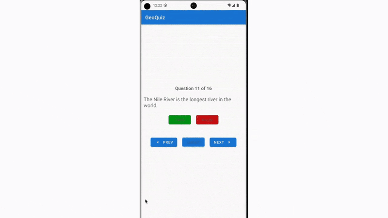

<h1 align="center">GeoQuiz</h1>
 

  <ul align="left" style="list-style: none;">
    

      <h2>Project description</h2>
    

  </ul>

GeoQuiz is an Android quiz app that challenges users with true/false questions about geography. It includes features such as tracking user progress, scoring, preventing multiple answers per question, and a "cheat" option with a penalty.

  <ul align="left" style="list-style: none;">
    

      <h2>Features</h2>
    

  </ul>

<ul>
  <li><b>True/False Quiz:</b> Answer geography-related questions.</li>
  <li><b>Navigation:</b> Move between previous and next questions.</li>
  <li><b>Score Tracking:</b> Correct answers increase the score.</li>
  <li><b>Cheat Functionality:</b> Users can reveal the correct answer but do not get a point.</li>
  <li><b>Persistence:</b> Tracks answered and cheated questions across configuration changes.</li>
</ul>

<h2>Technologies Used</h2>

<h2>Getting Started</h2>
To get a local copy up and running, follow these simple steps.

<h3>Prerequisites</h3>
<h5>Before running GeoQuiz, ensure you have the following:</h5>
- Android Studio  
- Java 8+ or Kotlin support installed in Android Studio 
- Android SDK 30+  
- A physical Android device or an Android Emulator 

<h3>Installation</h3>
<h5>Clone the repository:</h5>
https://github.com/Yuliia-Kruta/geoquiz.git

<h5>Open the project in Android Studio.</h5>

<h5>Sync Gradle and install dependencies.</h5>

<h5>Build and run the app on an emulator or physical device.</h5>

<h2>How to Play</h2>
- Users start the quiz and answer true/false questions. 
- The "Cheat" button reveals the correct answer but marks the question as cheated. 
- A score dialog appears at the end, displaying the final score. 
- The Restart option allows replaying the quiz. 

<h2>License</h2>
Distributed under the MIT License. See LICENSE for more information.
